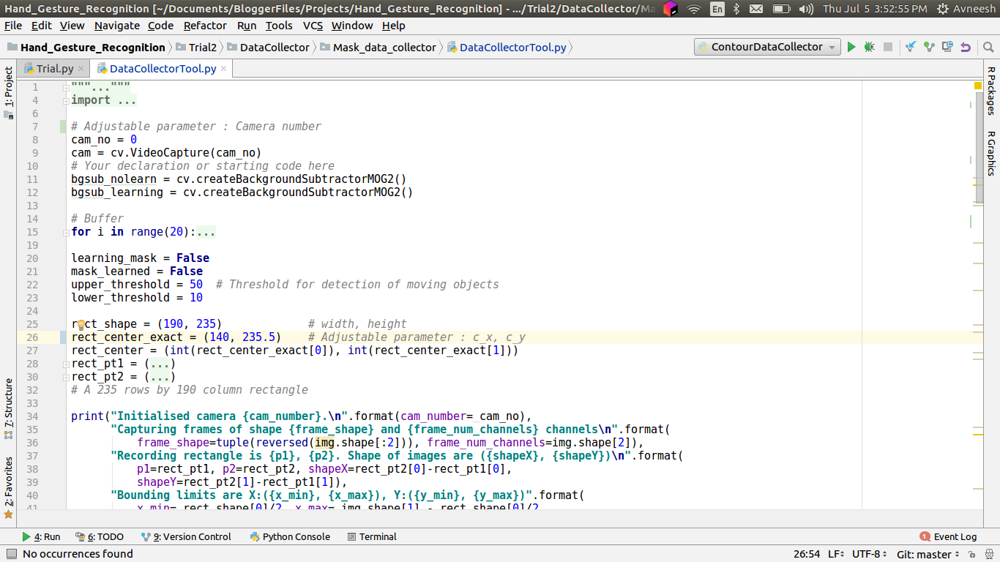
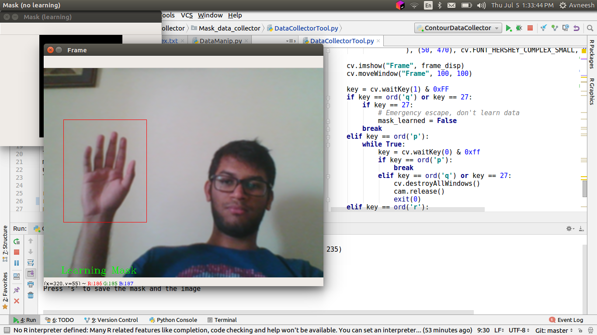
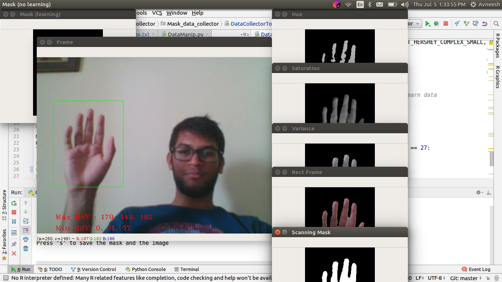
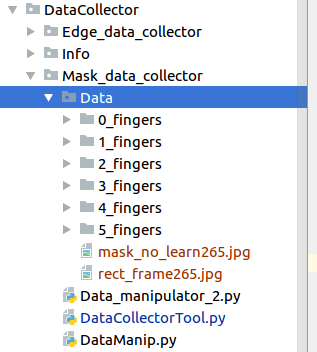

# About Directory
The DataCollector package is to collect, store and augment the data for machine learning solutions folder. 
This file has the information on using the files in this package.

## Description of contents
The file hierarchy and a brief description of each file is shown below, we'll discuss the details later in this file
- **Mask_data_collector** : To capture images and augmenting data.
  - *DataCollectorTool.py* : To capture examples using a webcam
  - *DataManip.py* : To augment the collected data and save the augmented data as well as numpy file
  - *Data_manipulator_2.py* : To generate data of particular distribution ratio. You can define a true to false ratio through this file to generate data to experiment the training
  - *FileFinder.py* : To sort the data collected into categories in the Data folder
  - *FileHandler.py* : To handle indexing of the files
  - *Index.txt* : Stores the index of the image to save
- **Edge_data_collector** : To deal with edge data from the images captured
    - *DataManip.py* : The data manipulator file in this directory. It is used to augment the captured data, perform canny edge operation and then save it the same way as in the "Mask_data_collector" directory.

Let's walk through on how to collect data from a webacam
### Collecting Mask data images
Get a uniform background for this
1. Initialize parameters in the *DataCollectorTool.py* file, the camera number and center of the recording rectangle on frame (you can test run once to adjust these parameters). All the parameters that you can adjust have the "Adjustable parameter" comment. You might want to delete the `Index.txt` file if you're starting this fresh. Also, create a folder named `Data` in the same directory to save the taken snaps, you can divide all the images into subfolders here.

2. Run the *DataCollectorTool.py* file.
3. Get the gesture inside the rectangle, wait for the program to learn the mask. Be sure to take only one gesture in a single batch so that grouping is easier.

4. Just after the mask is prepared, 5 new windows are opened to show the properties of the learned mask (mask, colour mask, hue, saturation and variance). Along with that, you can see the HSV bounds.

  1. If you're satisfied with the mask, and the colour result, press `s` key to save the mask and image. You'll observe that two new images have been created in the `Data` folder.
  2. If you're not satisfied with the mask, press `r` to reset the mask and take it again.
5. After saving as many masks as needed, exit the program by pressing `q`.
6. Check the **Data** folder, you'll find two files for every snap taken. One mask and other coloured. FIle starting with _mask_ is the mask and file starting with _rect_ is the colour frame. 

7. Open *FileFinder.py* and run the program, it deletes the colour frame and saves the mask frame with a name of pattern M_\*.jpg in the same directory as these codes. You can set the index number to match the previously recorded data. For example, if the latest file in Data/<Your classification folder> is M_23.jpg, then set the value of starting index to 24. After that, move the file in the label subfolder.
8. If you want to generate augmented data by flipping all training examples horizontally, open the file *DataManip.py* and run it once, it'll create two folders.
  1. **Data_augmented** : Has all the images in the same labelled folder with their horizontally flipped version.
  2. **Data_numpy_files** : Has three files, *X.npy* contains the numpy array of inputs (column stacked), *Y.npy* contains the numpy array of outputs (indexed labels) and *Y_one_hot_encoded.npy* contans one hot encoded outputs of every example.
